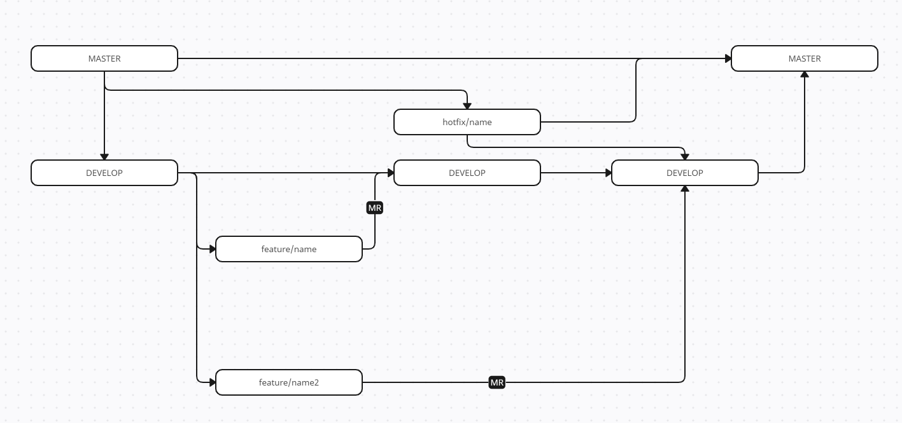

# git-fwt-flow

## Концепция

У нас есть основная ветка для разработки ```develop```, ветка для релиза ```master```

На этапе создания проекта создается ветка ```master``` и от нее ветвиться ветка ```develop```

Каждая задача делается в своей ветке (одна задача - одна ветка) ```feature/name``` которая ветвиться от ветки ```develop``` объединение веток происходит в результате принятия MR (merge request) или PR (Pull request)

Так же у нас имеются ```hotfix/name``` ветки которые ветвятся от ветки ```master```, выливаются в ветку ```master``` и в ```develop``` используется в случаях когда нужно срочно поправить баг на боевом сервере

## Схема 



## Именование веток

### Case
    kebab-case

### Master ветка
    master
Используется как основная ветка проекта, в ней содержится код который можно выкатывать на production сервер
### Develop ветка
    develop
Ветка для разработки, используется как ветка для тестирования, обычно выкатывается на dev сервер, после тестирования изменения выливаются в ```master``` ветку
### Feature ветка
    git checkout develop
    git checkout -b feature/feature-name
Используется для разработки определенной задачи, после разработки создается PR или MR для объединения задачи в ```develop``` ветку для тестирования

Именование ветки должно быть коротким и кратко объяснять суть задачи

##### Пример
    feature/added-migrations


### Hotfix ветка
    git checkout master
    git checkout -b hotfix/hotfix-name
Используется для быстрых фиксов на production сервере, ветвление идет из ```master``` ветки, изменения выливаются в ```master``` и в ```develop``` ветку чтобы избежать конфликтов и несоответствия кода между ветками

Именование ветки должно быть коротким и кратко объяснять суть фикса

##### Пример
    hotfix/fix-product-attributes